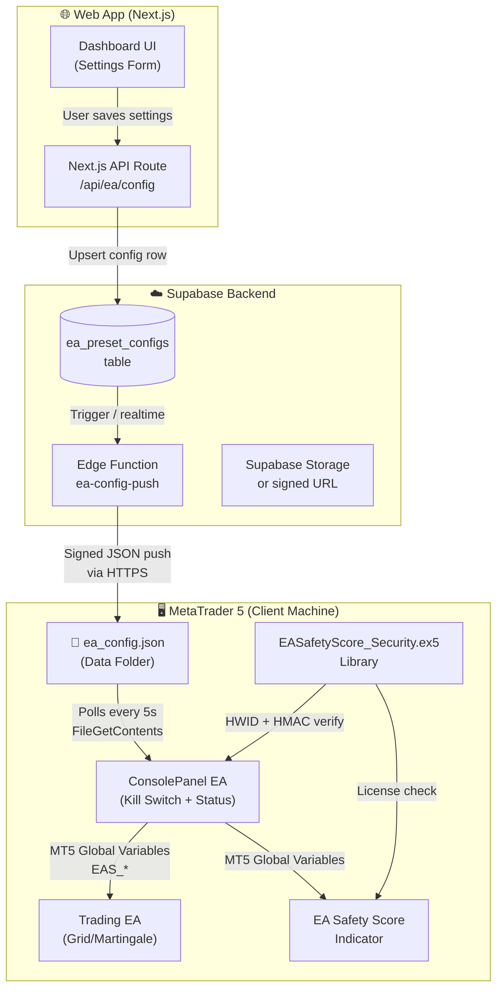
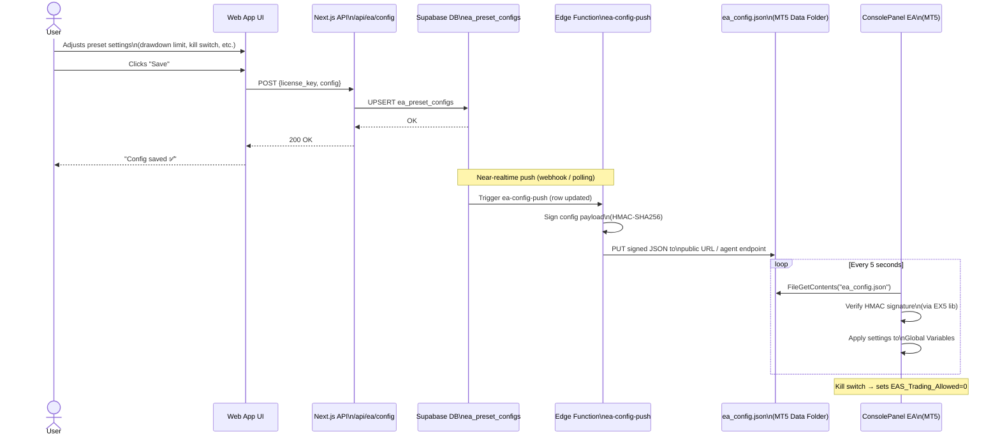
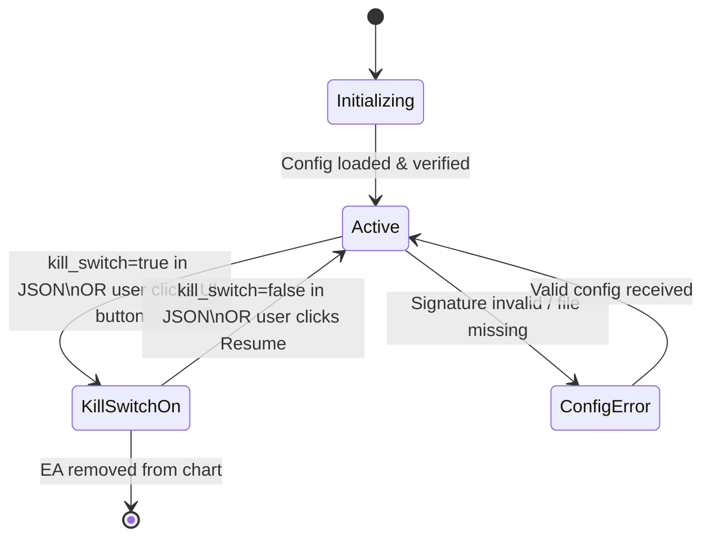
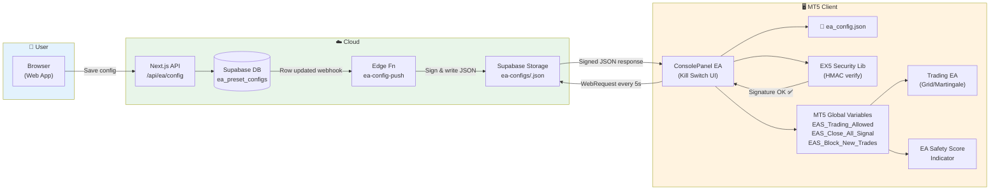

# EA Config Control System — Architecture Plan

## Overview

This plan describes how to:

1. **Convert** [EASafetyScore_Security.dll](file:///Users/rithsila/Projects/SafetyScore/docs/Dll/EASafetyScore_Security.dll) → a native MQL5 `EASafetyScore_Security.ex5` library (eliminating Windows DLL dependency)
2. **Add a Config Control layer**: the web app's dashboard UI sends preset settings, which the server persists and delivers to the EA in real time via a JSON config file
3. **Build a Trading Panel in MT5** with a live kill switch, status display, and config viewer

The central idea is a **JSON config file** (`ea_config.json`) that lives in the EA's data folder. The Supabase server writes it; the EA polls/watches it. This avoids complex websocket logic inside MQL5.

---

## Why Replace the DLL with EX5?

| Concern                      | DLL                        | EX5 Library           |
| ---------------------------- | -------------------------- | --------------------- |
| Requires "Allow DLL imports" | ✅ Yes (friction)          | ❌ No                 |
| Platform portability         | Windows only               | MT5 cross-platform    |
| Compilation & distribution   | C++ build toolchain needed | MetaEditor only       |
| Security model               | Broad OS access            | MQL5 sandbox          |
| HWID / crypto                | Win32 BCrypt, WinHTTP      | Pure MQL5 equivalents |

> [!IMPORTANT]
> The DLL currently handles: HWID (SHA-256), HMAC-SHA256 signature verification, HTTP license check (WinHTTP), and anti-debug. All of these have MQL5-native equivalents that we will use in the EX5 library.

---

## System Architecture



---

## Data Flow: Web App → EA (Config Push)



---

## Component Breakdown

### 1. `EASafetyScore_Security.ex5` — Native MQL5 Library

Replaces all DLL functions with MQL5 equivalents.

| DLL Function                                                                                                  | EX5 Replacement Strategy                                                                                                                                  |
| ------------------------------------------------------------------------------------------------------------- | --------------------------------------------------------------------------------------------------------------------------------------------------------- |
| [GetHardwareFingerprint()](file:///Users/rithsila/Projects/SafetyScore/docs/Dll/src/SecurityDLL.cpp#297-336)  | Combine `TerminalInfoInteger(TERMINAL_BUILD)` + `AccountInfoInteger(ACCOUNT_LOGIN)` + machine name via `EnvironmentGetVariable` → hash with `CryptEncode` |
| [VerifyResponseSignature()](file:///Users/rithsila/Projects/SafetyScore/docs/Dll/src/SecurityDLL.cpp#350-392) | Pure MQL5 HMAC-SHA256 using `CryptEncode(CRYPT_HASH_SHA256)` with key chaining                                                                            |
| [IsDebuggerAttached()](file:///Users/rithsila/Projects/SafetyScore/docs/Dll/src/SecurityDLL.cpp#506-531)      | Check via `MQLInfoInteger(MQL_TESTER)` or omit (MQL5 sandbox limits this anyway)                                                                          |
| [ValidateLicenseOnline()](file:///Users/rithsila/Projects/SafetyScore/docs/Dll/src/SecurityDLL.cpp#555-729)   | `WebRequest()` to Supabase Edge Function                                                                                                                  |
| [SendAlertEventOnline()](file:///Users/rithsila/Projects/SafetyScore/docs/Dll/src/SecurityDLL.cpp#730-907)    | `WebRequest()` to `/functions/v1/alerts`                                                                                                                  |
| [ClearHWIDCache()](file:///Users/rithsila/Projects/SafetyScore/docs/Dll/src/SecurityDLL.cpp#911-917)          | Reset static cached string variable                                                                                                                       |
| [GetDLLVersion()](file:///Users/rithsila/Projects/SafetyScore/docs/Dll/src/SecurityDLL.cpp#288-293)           | Return integer constant                                                                                                                                   |

**File**: `MQL5/Libraries/EASafetyScore_Security.mq5`  
**Output**: `EASafetyScore_Security.ex5`

```mql5
// Key export pattern — MQL5 libraries use #import on the caller side
// Functions marked with #property library are exported automatically
#property library
#property strict

// HMAC-SHA256 using MQL5 CryptEncode
string VerifySignature(string payload, string timestamp, string secret) export {
    // Step 1: key = HMAC(secret, "")  — derive inner/outer keys manually
    // Step 2: message = payload + timestamp
    // Step 3: Compare with provided signature
}
```

---

### 2. Config JSON Schema

Stored in MT5 Data Folder: `MQL5/Files/ea_config.json`

```json
{
  "version": 3,
  "issued_at": 1742034000,
  "license_key": "xxxxxxxx-xxxx-xxxx-xxxx-xxxxxxxxxxxx",
  "signature": "abc123...64hexchars",
  "kill_switch": false,
  "preset": {
    "drawdown_limit_pct": 20.0,
    "close_on_caution": false,
    "close_on_danger": true,
    "stop_trading_on_danger": true,
    "block_new_trades_on_danger": true,
    "enable_telegram": false,
    "telegram_chat_id": "",
    "safe_score_threshold": 5,
    "danger_score_threshold": 0,
    "enable_drawdown_protection": true
  },
  "console": {
    "message": "Market conditions: High volatility. Caution advised.",
    "badge": "warning"
  }
}
```

---

### 3. ConsolePanel EA — MT5 Console Page with Kill Switch

New EA: `MQL5/Experts/EASafetyScore/ConsolePanel.mq5`

**Features:**

- 🖥️ **Graphical panel** overlaid on chart — shows config status, version, last-received time
- 🔴 **Kill Switch button** — immediately sets `EAS_Trading_Allowed = 0` globally
- 🟢 **Resume button** — re-enables trading
- 📄 **Config inspector** — shows current loaded preset values
- 🔄 **Auto-refresh** every 5 seconds (`OnTimer`)
- ✅ **Signature verification** before applying any config (via EX5 lib)
- 📌 **Server message banner** from `console.message` field

**Kill Switch State Machine:**



---

### 4. Web App — Settings UI

**New API Route**: `POST /api/ea/config`

```typescript
// /web/src/app/api/ea/config/route.ts
export async function POST(request: Request) {
  const auth = await requireAdminApi(); // or user auth
  const { license_key, preset, kill_switch } = await request.json();

  await supabase.from("ea_preset_configs").upsert({
    license_key,
    config: { preset, kill_switch },
    updated_at: new Date().toISOString(),
  });

  // Trigger edge function push
  await triggerConfigPush(license_key);

  return NextResponse.json({ ok: true });
}
```

**New Dashboard Page**: `/dashboard/ea-control`

- Shows current config for linked license
- Toggle kill switch with confirmation dialog
- Edit preset fields (drawdown %, score thresholds, etc.)
- "Push to EA" button → calls `/api/ea/config`
- Status badge: "EA Online / Offline" based on last-heartbeat timestamp in DB

---

### 5. Supabase — New Table & Edge Function

#### New DB Table: `ea_preset_configs`

```sql
CREATE TABLE ea_preset_configs (
  id          UUID DEFAULT gen_random_uuid() PRIMARY KEY,
  license_key UUID REFERENCES licenses(id),
  config      JSONB NOT NULL DEFAULT '{}',
  kill_switch BOOLEAN DEFAULT FALSE,
  updated_at  TIMESTAMPTZ DEFAULT NOW(),
  pushed_at   TIMESTAMPTZ,
  version     INTEGER DEFAULT 1
);
-- RLS: users can only read/write their own license's config
```

#### New Edge Function: `ea-config-push`

- Triggered by DB webhook when `ea_preset_configs` row is updated
- Signs the full config JSON with `LICENSE_SIGNING_SECRET` (HMAC-SHA256)
- Stores signed config as a downloadable file in Supabase Storage (public URL per license)
- EA fetches from: `https://<project>.supabase.co/storage/v1/object/public/ea-configs/<license_key>.json`

---

## Full Flow Diagram (End-to-End)



---

## Implementation Strategy: Two-Track Approach

**Track A (now):** Build Trading Panel end-to-end. DLL stays untouched. ConsolePanel EA uses pure MQL5 for HMAC and WebRequest — no DLL dependency.

**Track B (future):** Port DLL → EX5 library as a separate project. Requires HWID reset plan since MQL5 fingerprints differ from Win32 DLL fingerprints.

---

## Implementation Phases (Track A)

### Phase 1 — Database + Edge Functions (3-4 days)

- Write migration `028_add_ea_config_tables.sql` (3 tables: `ea_preset_configs`, `ea_status_reports`, `ea_trading_journal`)
- Implement `ea-config-push` Edge Function (sign config JSON + upload to Storage)
- Implement `ea-status-report` Edge Function (receive MT5 status POST, upsert to DB)
- Add Supabase Storage bucket `ea-configs` with public read
- RLS policies on all tables

### Phase 2 — Web App UI (1-2 weeks)

- API routes: `/api/ea/accounts` (GET), `/api/ea/config` (GET/POST), `/api/ea/status` (GET)
- `/dashboard/trading-panel` overview page — summary KPIs across all accounts, account cards
- `/dashboard/trading-panel/[accountNumber]` detail page — status, config editor, preset selector, kill switch, journal
- Update sidebar: dynamic account sub-items, remove `soon: true`
- Components: status cards, config editor, kill switch toggle, trading journal table

### Phase 3 — ConsolePanel EA (1-2 weeks)

Pure MQL5. No DLL dependency. Runs alongside existing indicator.

- Create `ConsolePanel.mq5` EA skeleton
- Implement `OnTimer()` config polling (every 5s) via `WebRequest()` to Storage URL
- Implement pure MQL5 HMAC-SHA256 signature verification using `CryptEncode`
- Implement MT5 Global Variable writers for config overrides
- Implement status reporting: collect `EASS.*` GVs + `AccountInfoDouble()`, POST to edge function every 30s
- Build graphical panel (kill switch button, status display, config viewer)

### Phase 4 — Indicator Modification (3-4 days)

Small change. DLL usage unchanged.

- Add `ReadConfigFromGlobalVariables()` in `OnCalculate`
- Check `EAS_CONFIG.<Symbol>.*` GVs set by ConsolePanel EA
- Override input parameters if GVs exist; fallback to original inputs if no GVs
- Test indicator works standalone (without ConsolePanel EA)

### Phase 5 — Integration & Testing (3-4 days)

- Full round-trip: save config in web → EA picks up → indicator applies → status back to web
- Kill switch: toggle ON in web → EA stops trading within 5s
- Resume: toggle OFF → EA resumes
- Invalid signature: corrupt JSON → ConsolePanel rejects, keeps old config
- Multi-account: each account gets independent config and status

---

## Future: Track B — DLL to EX5 Migration

Separate project. Not blocking Track A.

- Create `EASafetyScore_Security.mq5` library
- Port [GetHardwareFingerprint()](file:///Users/rithsila/Projects/SafetyScore/docs/Dll/src/SecurityDLL.cpp#297-336) → MQL5 `CryptEncode` SHA-256
- Port [VerifyResponseSignature()](file:///Users/rithsila/Projects/SafetyScore/docs/Dll/src/SecurityDLL.cpp#350-392) → MQL5 HMAC-SHA256
- Port [ValidateLicenseOnline()](file:///Users/rithsila/Projects/SafetyScore/docs/Dll/src/SecurityDLL.cpp#555-729) → `WebRequest()` to Supabase
- Port [SendAlertEventOnline()](file:///Users/rithsila/Projects/SafetyScore/docs/Dll/src/SecurityDLL.cpp#730-907) → `WebRequest()` to alerts endpoint
- Requires HWID reset migration for all existing `bound_hwid` values

---

## Verification Plan

### Automated

- Deno unit tests for `ea-config-push` Edge Function (signing logic)
- Deno unit tests for `ea-status-report` Edge Function (validation + upsert)
- MQL5 unit test script for pure MQL5 HMAC verification in ConsolePanel EA

### Manual

1. **Config Push Test**: Change `drawdown_limit_pct` in web UI → click Save → check `ea_config.json` on disk reflects new value within 10 seconds
2. **Kill Switch Test**: Toggle kill switch ON in web UI → verify `EAS_Trading_Allowed = 0` in MT5 Global Variables within 5 seconds
3. **Signature Rejection Test**: Manually corrupt the JSON file → ConsolePanel should log "INVALID SIGNATURE" and not apply changes
4. **Multi-Account Test**: Push different configs to two accounts → verify each applies independently
